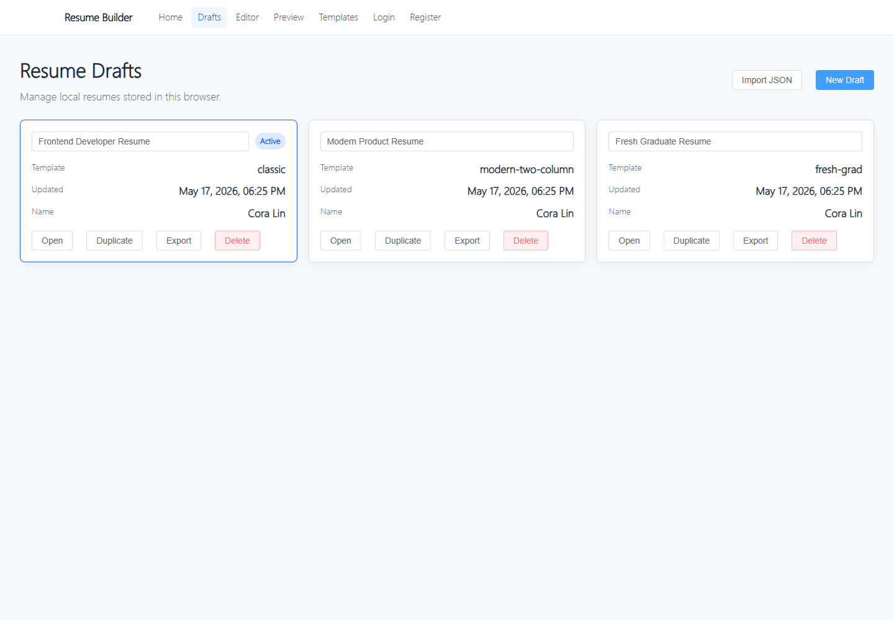
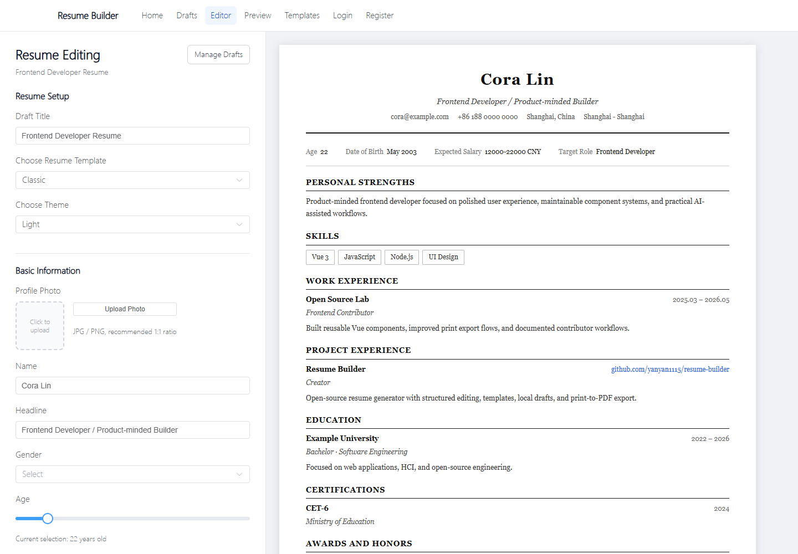
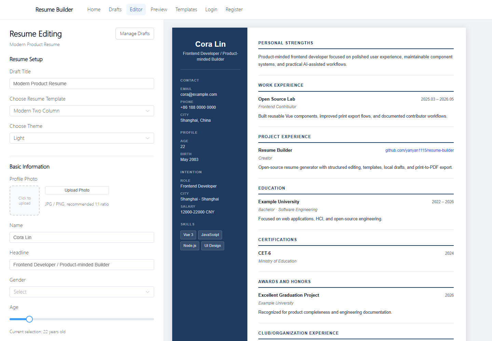
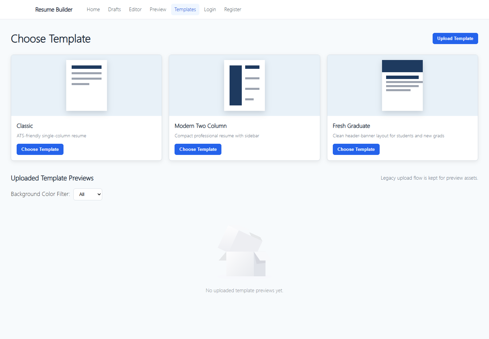

# Resume Builder

Resume Builder is an open-source, self-hostable resume creation tool built with Vue, Pinia, Express, and MongoDB. It now has the core product loop in place: local draft management, structured resume editing, real layout templates, live preview, and browser-native print-to-PDF export.

The project is still pre-beta, but it is ready enough for contributors to run locally, inspect the architecture, and help turn it into a polished resume builder.

## Core Features

- Local multi-resume draft management with create, open, duplicate, rename, and delete flows.
- Canonical resume schema shared by editor, preview, template rendering, export, and backend persistence groundwork.
- Structured editor for basics, job intention, skills, work experience, projects, education, certificates, awards, and organizations.
- Real template registry with multiple layout components:
  - Classic single-column resume.
  - Modern two-column resume.
- Theme support retained for existing light, dark, blue, purple, pink, and red CSS themes.
- Live preview powered by the active canonical draft.
- Browser-native `Print / Save as PDF` export for sharper, selectable text.
- Legacy screenshot PDF, HTML, and Word export paths retained as secondary options.
- Express/MongoDB backend foundation for auth, template metadata, resume persistence, and uploads.

## Current Status

The project has completed first implementations for Stages 0-6:

- Documentation and setup baseline.
- Stability cleanup.
- Shared resume schema.
- Structured editor redesign.
- Real template system.
- Export quality baseline.
- Local draft management.

Stage 6.5 focuses on open-source showcase and QA polish. Backend sync, richer template contribution workflows, and optional AI features are still future work.

## Screenshots

### Draft Management



### Classic Editor



### Modern Two Column Editor



### Template Gallery



## Quick Start

Install frontend dependencies:

```bash
npm install
```

Run the frontend:

```bash
npm run serve
```

Open:

```text
http://localhost:8080
```

Useful routes:

- `/drafts`: local resume draft manager.
- `/editor`: structured editor for the active draft.
- `/preview`: preview for the active draft.
- `/templates`: template gallery and uploaded template preview area.

Build and lint:

```bash
npm run lint
npm run build
```

## Backend Setup

Install backend dependencies:

```bash
cd backend
npm install
```

Create an environment file:

```bash
cp backend/.env.example backend/.env
```

On Windows PowerShell:

```powershell
Copy-Item backend/.env.example backend/.env
```

Fill in `MONGO_URI`, `JWT_SECRET`, `PORT`, and `PUBLIC_BASE_URL`, then run:

```bash
cd backend
npm start
```

The web app works in local-only draft mode without the backend. Backend resume synchronization is planned as a later enhancement.

## Documentation

- [Product Requirements](docs/PRD.md)
- [Architecture](docs/ARCHITECTURE.md)
- [Roadmap](docs/ROADMAP.md)
- [Resume Schema](docs/RESUME_SCHEMA.md)
- [Setup Guide](docs/SETUP.md)
- [QA Checklist](docs/QA_CHECKLIST.md)
- [Release Notes](docs/RELEASE_NOTES.md)
- [Release Checklist](docs/RELEASE_CHECKLIST.md)
- [Sample Resume](docs/SAMPLE_RESUME.md)
- [Contribution Guide](CONTRIBUTING.md)

## Roadmap Summary

- Stage 6.5: Open-source showcase and QA polish.
- Stage 7: Optional AI features such as job description matching, keyword suggestions, and bullet improvement.
- Beta preparation: screenshots, demo GIF, issue templates, and a tagged first release.
- Backend draft sync: connect local draft workflows to authenticated backend persistence.

## Known Limitations

- Bundle size is still high because the dependency list includes export, 3D, and experimental libraries.
- Uploaded template previews are not yet a full template contribution system.
- Browser-native print is the recommended PDF path; legacy screenshot PDF remains available but is lower quality.
- Local mobile experiments are not included in this beta release.

## Mobile App Status

This beta release focuses on the web application. Earlier local mobile experiments are intentionally excluded from the public beta branch to keep the release scope clear and runnable.

If mobile support returns later, it should start as a fresh plan around the stabilized web product, likely as a separate repository or package that consumes the same resume schema.

## Acknowledgements

This beta was shaped and directed by Cora, with OpenAI Codex assisting as an AI coding collaborator during documentation, refactoring, QA, and release preparation.

## License

This project is licensed under the [MIT License](LICENSE).
