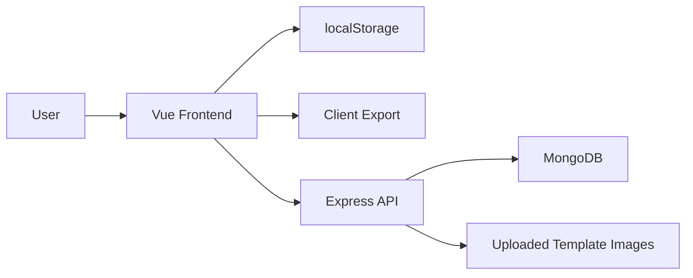
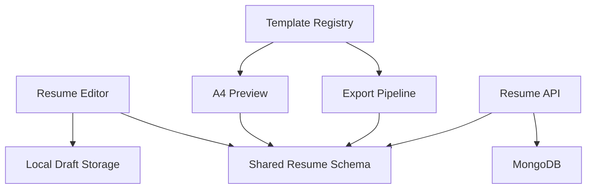
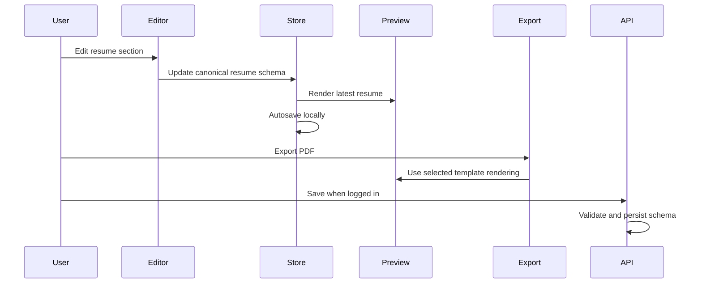

# Architecture

Related documents:

- [Product Requirements](PRD.md)
- [Roadmap](ROADMAP.md)
- [Resume Schema](RESUME_SCHEMA.md)

## 1. Current Architecture

The project currently contains a Vue frontend and an Express backend.



## 2. Current Frontend

Frontend entry points:

- `src/main.js`: creates the Vue app, installs Pinia, Element Plus, and router.
- `src/App.vue`: global navigation, loading overlay, route outlet.
- `src/router/index.js`: page routes.

Important pages:

- `src/views/HomePage.vue`: landing/home screen.
- `src/views/ResumeEditor.vue`: resume input form, template/theme selection, export trigger.
- `src/components/template.vue`: current live preview component.
- `src/views/TemplateSelection.vue`: template preview list loaded from backend.
- `src/views/UploadTemplate.vue`: uploads template preview images and metadata.
- `src/views/LoginPage.vue` and `src/views/RegisterPage.vue`: authentication UI.

Current limitations:

- The editor owns a resume object, but the data shape differs from backend resume data.
- The template system mostly switches color theme CSS.
- API requests go through `src/api/client.js`, which defaults to `http://localhost:5000/api` and can be overridden with `VUE_APP_API_BASE_URL`.
- Some navigation targets do not match configured routes.
- Export logic is embedded directly in `ResumeEditor.vue`.

## 3. Current Backend

Backend entry point:

- `backend/server.js`: Express app, MongoDB connection, routes, upload static files.

Backend modules:

- `backend/models/userModel.js`: user schema.
- `backend/models/resumeModel.js`: resume schema.
- `backend/models/templateModel.js`: template preview metadata schema.
- `backend/routes/userRoutes.js`: register, login, profile.
- `backend/routes/resumeRoutes.js`: resume CRUD and PDF generation route.
- `backend/routes/templateRoutes.js`: template list, create, delete.
- `backend/middleware/authMiddleware.js`: JWT authentication.
- `backend/middleware/upload.js`: Multer upload configuration.

Current limitations:

- Resume routes are protected in `backend/routes/resumeRoutes.js`.
- Frontend editor does not fully use backend resume CRUD.
- Template upload stores preview images, not real layout templates.
- Uploaded asset URLs can use `PUBLIC_BASE_URL`.
- Environment variables are documented in `backend/.env.example`.

## 4. Target Architecture

The target architecture should separate product concerns clearly.

The canonical data contract is defined in [RESUME_SCHEMA.md](RESUME_SCHEMA.md).



Core principles:

- Resume data should have one canonical schema.
- Templates should render schema data, not own business logic.
- Export should reuse the same template rendering rules as preview.
- Local-only editing should work without requiring backend login.
- Backend save should be an enhancement, not a blocker for basic usage.

## 5. Proposed Frontend Structure

```text
src/
├── api/                 # axios client and endpoint wrappers
├── components/
│   ├── editor/          # section editors and field groups
│   ├── export/          # export actions and print helpers
│   ├── resume/          # A4 preview and shared resume rendering components
│   └── templates/       # template components
├── data/                # static options and seed resume data
├── router/
├── schemas/             # resume schema defaults and validators
├── stores/              # resume drafts, auth, templates
├── styles/
└── views/
```

This structure does not need to be introduced all at once. It can be created gradually as each module is refactored.

## 6. Proposed Resume Schema

The canonical resume schema should support structured content and display settings.

```js
{
  id: "local-or-database-id",
  title: "Frontend Developer Resume",
  language: "en",
  templateId: "classic",
  basics: {
    name: "",
    email: "",
    phone: "",
    location: "",
    links: []
  },
  intention: {
    jobTitle: "",
    city: "",
    salaryRange: null,
    industry: ""
  },
  sections: [
    {
      id: "work",
      type: "experience",
      title: "Work Experience",
      visible: true,
      order: 10,
      items: []
    }
  ],
  theme: {
    color: "blue",
    font: "system"
  }
}
```

Exact field names can change during implementation, but the important decision is that the schema must be shared by editor, preview, export, and backend.

## 7. Template Architecture

Current template behavior:

- Template selection loads metadata from backend.
- Uploaded template data is mainly a preview image and theme name.
- The actual rendered resume layout remains mostly the same.

Stage 4 first implementation:

- `src/templates/registry.js` defines first-party layout templates with `id`, `name`, `scenario`, `preview`, `component`, and `themeSupport`.
- `src/components/template.vue` is now a dynamic host that selects the registered layout component from `resume.templateId`.
- `ClassicTemplate.vue` preserves the original single-column layout.
- `ModernTwoColumnTemplate.vue` adds a distinct sidebar/content layout.
- Uploaded templates remain available as preview/theme assets until a later registry-backed contribution flow replaces them.

Target template behavior:

```text
Template metadata
  -> template gallery
  -> template component
  -> preview rendering
  -> print/export rendering
```

Template registry example:

```js
export const templates = [
  {
    id: "classic",
    name: "Classic",
    scenario: "ATS-friendly",
    preview: "/template-previews/classic.png",
    component: ClassicTemplate
  }
]
```

## 8. Export Architecture

Current export:

- PDF: `html2canvas` captures the preview DOM and `jsPDF` creates pages from images.
- Word: converts HTML content into a docx blob.
- HTML: serializes preview HTML and styles.

Stage 5 first implementation:

- The primary PDF path is now browser-native `Print / Save as PDF`.
- Registered templates provide A4 `@media print` styles and section page-break rules.
- Editor controls are hidden during print, so the active template component is the printed surface.
- The screenshot-based `html2canvas` + `jsPDF` export remains available as a legacy fallback.
- Word and HTML export are still secondary client-side paths.

Target export:

1. Print CSS baseline:
   - A4 page size.
   - Page-break rules.
   - Sharp text through browser print-to-PDF.

2. Optional server-side PDF:
   - Send resume schema and template ID to backend.
   - Render with Puppeteer.
   - Return a downloadable PDF.

3. Secondary formats:
   - Keep HTML export for portability.
   - Improve Word export only after PDF quality is stable.

## 9. Data Flow

Recommended future data flow:



Stage 6 first implementation:

- `src/stores/resumeStore.js` owns local draft collection actions.
- Drafts are stored in `resume-builder:drafts`.
- The active draft ID is stored in `resume-builder:active-draft-id`.
- `/drafts` lists local canonical drafts and supports create, open, duplicate, rename, and delete.
- `/editor` and `/preview` continue to load the active draft from the store.
- Backend persistence is still separate from the local draft workflow.

Stage 6.5 polish:

- README now presents the current open-source product status and quick-start flow.
- `docs/QA_CHECKLIST.md` records manual validation for drafts, editing, templates, and export.
- `docs/RELEASE_NOTES.md` summarizes completed first implementations.
- `docs/RELEASE_CHECKLIST.md` tracks beta release readiness.
- `docs/SAMPLE_RESUME.md` provides demo content for testing and screenshots.
- Remaining bundle-size risk is documented instead of being addressed through a broad dependency refactor.

## 10. Known Technical Risks

- Legacy screenshot PDF export quality may remain weak; browser print is the recommended PDF path.
- Template flexibility can become hard to maintain without a registry.
- Backend and frontend schemas may drift if shared conventions are not documented.
- The dependency list is currently broad and may increase bundle size.
- Mobile app scope may distract from stabilizing the web product.

## 11. Refactoring Guidelines

- Keep changes small and tied to roadmap stages.
- Do not rewrite the full app before stabilizing current flows.
- Introduce the shared resume schema before rebuilding templates.
- Move export logic out of page components before deeply changing export behavior.
- Prefer documented conventions over hidden assumptions.
